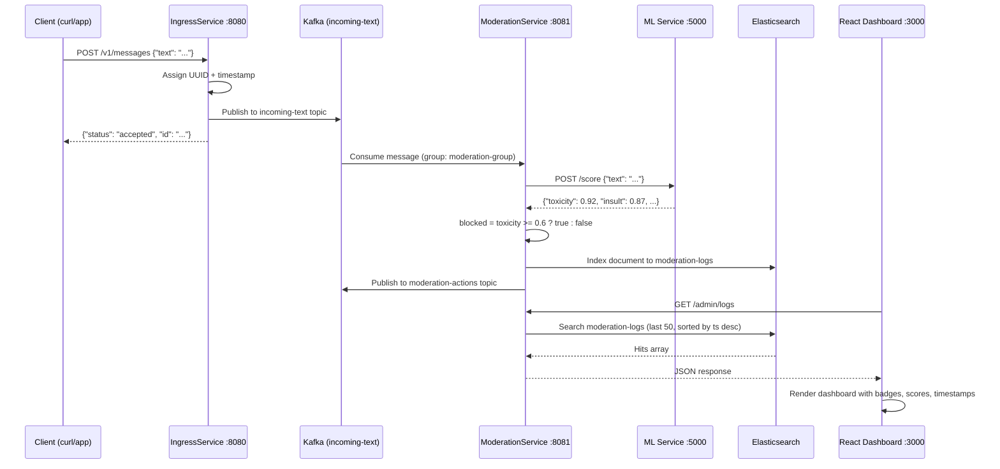

# 🔥 Suraksha-Setu

### *Real-Time Toxicity Firewall for the Internet*

> A production-grade microservice system that scans incoming text in real-time, detects toxicity, hate speech, and harmful content using ML, blocks bad actors, logs everything to Elasticsearch, and visualizes patterns through a modern React moderation dashboard.

---


---

## 📌 Overview

**Suraksha-Setu** (सुरक्षा-सेतु — *Bridge of Safety* in Hindi) is a distributed content moderation platform built as a microservice system. It scans any incoming text payload for toxicity, insults, hate speech, obscene language, and severe toxicity using a pre-trained ML model, and takes automated blocking decisions in real time.

The system is designed to feel like a **legitimate, startup-grade product** — complete with async message queues, ML scoring, structured logging, metrics scraping, and a live moderation dashboard.

**What it does in plain English:**
- You send a text message to the API
- It immediately gets published to Kafka
- A moderation worker picks it up, runs it through an ML toxicity scorer
- If the score crosses the threshold → the message is **blocked**
- The decision is logged to Elasticsearch and surfaced on a React dashboard
- Prometheus scrapes metrics; Grafana visualizes them

---

## 🏗️ Architecture

The system follows a **decoupled event-driven microservice architecture** with four independent services communicating via Kafka and HTTP.

```
┌─────────────┐       POST /v1/messages        ┌────────────────────┐
│   Client    │ ─────────────────────────────▶ │  IngressService    │
│ (curl/app)  │                                 │  (Java, port 8080) │
└─────────────┘                                 └────────┬───────────┘
                                                         │ Kafka publish
                                                         ▼
                                              ┌─────────────────────┐
                                              │   Kafka Topic:       │
                                              │   incoming-text      │
                                              └─────────┬───────────┘
                                                        │ Kafka consume
                                                        ▼
                                              ┌─────────────────────┐
                                              │  ModerationService   │
                                              │  (Java, port 8081)  │
                                              └───┬─────────────┬───┘
                          HTTP POST /score        │             │  Index doc
                     ┌────────────────────────────┘             ▼
                     ▼                                ┌──────────────────┐
          ┌──────────────────┐                        │  Elasticsearch   │
          │   ML Service     │                        │  moderation-logs │
          │ (Python/FastAPI) │                        └──────────────────┘
          │   port 5000      │                                  ▲
          └──────────────────┘                                  │
                                                     ┌──────────────────┐
                                                     │  React Dashboard │
                                                     │  (port 3000)     │
                                                     └──────────────────┘
                                                              ▲
                                              GET /admin/logs │
                                              via proxy to ModerationService

Metrics:  ModerationService → /actuator/prometheus → Prometheus → Grafana
```

### Services

| Service | Language | Port | Role |
|---|---|---|---|
| **IngressService** | Java / Spring Boot | 8080 | REST API gateway, Kafka producer |
| **ModerationService** | Java / Spring Boot | 8081 | Kafka consumer, ML caller, ES logger, metrics |
| **ML Service** | Python / FastAPI | 5000 | Toxicity scorer using Detoxify |
| **React Dashboard** | JavaScript / React | 3000 | Moderation UI with live stats |

### Infrastructure (Docker Compose)

| Container | Image | Port |
|---|---|---|
| Zookeeper | confluentinc/cp-zookeeper:7.0.1 | 2181 |
| Kafka | confluentinc/cp-kafka:7.0.1 | 9092 |
| Elasticsearch | elasticsearch:7.17.9 | 9200 |
| Kibana | kibana:7.17.9 | 5601 |
| Prometheus | prom/prometheus:v2.37.0 | 9090 |
| Grafana | grafana/grafana:9.1.0 | 3000 |

---

## 🔄 System Workflow



**Step-by-step:**

1. **Text ingestion** — Client sends a POST request with `{"text": "...", "userId": "..."}` to IngressService
2. **Normalization** — IngressService assigns a UUID and epoch timestamp, serializes to JSON
3. **Kafka publish** — Message is published to the `incoming-text` Kafka topic
4. **Async consumption** — ModerationService's `@KafkaListener` picks up the message from the `moderation-group` consumer group
5. **ML scoring** — ModerationService POSTs the raw text to the FastAPI ML service, which runs Detoxify and returns multi-label scores (toxicity, insult, obscene, severe_toxicity, identity_hate)
6. **Decision** — A threshold is applied (default: toxicity ≥ 0.6 → blocked)
7. **Elasticsearch indexing** — The full record (text, scores, blocked flag, timestamp) is indexed into the `moderation-logs` index
8. **Action event** — A moderation action is also published to the `moderation-actions` Kafka topic for downstream consumers
9. **Dashboard** — React polls `/admin/logs` which proxies an ES search query, rendering message history with toxicity bars and status badges
10. **Metrics** — Prometheus scrapes `/actuator/prometheus` every 15 seconds; Grafana visualizes JVM, Kafka lag, and custom moderation counters

---

## 🛠️ Tech Stack

### Backend
- **Java 8** — core language for both microservices
- **Spring Boot 2.5.13** — application framework, REST, Kafka integration, Actuator
- **Spring Kafka 2.7.11** — producer/consumer abstraction over Apache Kafka
- **Apache HttpComponents 4.5.13** — HTTP client for calling ML service and Elasticsearch
- **Jackson** — JSON serialization/deserialization
- **Micrometer + Prometheus Registry** — metrics instrumentation and export

### Frontend
- **React 18** (Create React App) — moderation dashboard
- **CSS3** — dark-mode custom styling with status badges and toxicity bars
- Proxied via `"proxy": "http://localhost:8081"` in `package.json`

### ML / AI
- **Python 3.10+** with **FastAPI** — lightweight async API server
- **Detoxify** (`original` model) — pre-trained multi-label toxicity classifier (toxicity, severe_toxicity, obscene, insult, identity_hate, threat)
- **PyTorch** — Detoxify model runtime
- **Uvicorn** — ASGI server for FastAPI

### Infrastructure
- **Apache Kafka 7.0.1** (Confluent) — async message streaming backbone
- **Apache Zookeeper 7.0.1** — Kafka coordination
- **Elasticsearch 7.17.9** — structured log storage and full-text search
- **Kibana 7.17.9** — log exploration UI
- **Prometheus 2.37** — metrics scraping and storage
- **Grafana 9.1.0** — metrics dashboards and visualization
- **Docker Compose** — full local infrastructure orchestration

### Dev Tools
- **IntelliJ IDEA Community Edition** — Java development
- **Maven** — build and dependency management
- **Postman** — API testing
- **SDKMAN** — Java version management

---

## 📁 Repository Structure

```
Suraksha-Setu/
│
├── docker-compose.yml          # Full infra: Kafka, Zookeeper, ES, Kibana, Prometheus, Grafana
├── prometheus.yml              # Prometheus scrape config (scrapes ModerationService actuator)
├── es-mapping.json             # Elasticsearch index mapping for moderation-logs
│
├── IngressService/             # Java Spring Boot — REST API & Kafka Producer
│   ├── pom.xml                 # Maven: spring-boot-starter-web, spring-kafka, jackson
│   └── src/main/
│       ├── java/com/nandinee/ingress/
│       │   ├── IngressApplication.java          # @SpringBootApplication entry point
│       │   └── controller/
│       │       └── MessageController.java       # POST /v1/messages → Kafka publish
│       └── resources/
│           └── application.yml                  # port: 8080, kafka bootstrap, topic config
│
├── ModerationService/          # Java Spring Boot — Kafka Consumer, ML caller, ES logger
│   ├── pom.xml                 # Maven: spring-kafka, httpclient, micrometer-prometheus
│   └── src/main/
│       ├── java/com/nandinee/
│       │   ├── ModerationApplication.java       # @SpringBootApplication entry point
│       │   ├── service/
│       │   │   └── ModerationListener.java      # @KafkaListener → score → block → index
│       │   └── controller/
│       │       └── QueryController.java         # GET /admin/logs → ES proxy for React
│       └── resources/
│           └── application.yml                  # port: 8081, kafka consumer, ML/ES URLs
│
├── ml-service/                 # Python FastAPI — Detoxify toxicity scorer
│   ├── app.py                  # POST /score → Detoxify.predict() → scores JSON
│   └── requirements.txt        # fastapi, uvicorn, detoxify, torch, numpy
│
├── react-dashboard/            # React — dark-mode moderation control panel
│   └── src/
│       ├── App.js              # Summary cards, latest message, activity feed
│       └── App.css             # Dark theme, badge styles, toxicity bar
│
└── LICENSE                     # MIT
```

---

## 🚀 Installation & Setup

### Prerequisites

| Tool | Version |
|---|---|
| Java (SDKMAN recommended) | 8 (Zulu/Adopt) |
| Maven | 3.6+ |
| Python | 3.10+ |
| Node.js | 18 LTS+ |
| Docker Desktop | Latest |
| Postman | Latest |

### 1. Clone the repository

```bash
git clone https://github.com/TheNandinee/Suraksha-Setu.git
cd Suraksha-Setu
```

### 2. Start infrastructure

```bash
docker-compose up -d
```

Verify all containers are running:

```bash
docker ps
```

Expect: `kafka`, `zookeeper`, `elasticsearch`, `kibana`, `prometheus`, `grafana`

### 3. Create Elasticsearch index

```bash
curl -X PUT "http://localhost:9200/moderation-logs?pretty" \
  -H 'Content-Type: application/json' \
  -d @es-mapping.json
```

### 4. Create Kafka topics

```bash
docker exec -it $(docker ps --filter "ancestor=confluentinc/cp-kafka:7.0.1" -q) \
  kafka-topics --create --topic incoming-text \
  --bootstrap-server localhost:9092 --partitions 3 --replication-factor 1

docker exec -it $(docker ps --filter "ancestor=confluentinc/cp-kafka:7.0.1" -q) \
  kafka-topics --create --topic moderation-actions \
  --bootstrap-server localhost:9092 --partitions 3 --replication-factor 1
```

### 5. Start the ML Service

```bash
cd ml-service
python3 -m venv venv
source venv/bin/activate      # Windows: venv\Scripts\activate
pip install -r requirements.txt
uvicorn app:app --host 0.0.0.0 --port 5000
```

> ⚠️ First run will download ~300MB of Detoxify model weights. Keep the terminal open.

### 6. Start ModerationService

```bash
cd ../ModerationService
mvn clean package
mvn spring-boot:run
```

Or open the folder in **IntelliJ IDEA CE** → Run `ModerationApplication.main()`

### 7. Start IngressService

```bash
cd ../IngressService
mvn clean package
mvn spring-boot:run
```

### 8. Start React Dashboard

```bash
cd ../react-dashboard
npm install
npm start
```

Dashboard opens at **http://localhost:3000**

---

## 📡 Usage

### Send a message via curl

```bash
# Toxic message — will be blocked
curl -X POST "http://localhost:8080/v1/messages" \
  -H "Content-Type: application/json" \
  -d '{"text": "You are a stupid idiot", "userId": "user-123"}'
```

**Expected response:**
```json
{"status": "accepted", "id": "7f3c2a1b-..."}
```

### Test more samples

```bash
# Safe message — will be allowed
curl -X POST "http://localhost:8080/v1/messages" \
  -H "Content-Type: application/json" \
  -d '{"text": "Have a wonderful day!", "userId": "user-456"}'

# Hate speech — blocked
curl -X POST "http://localhost:8080/v1/messages" \
  -H "Content-Type: application/json" \
  -d '{"text": "I hate all of you", "userId": "user-789"}'
```

### Test ML service directly

```bash
curl -X POST "http://localhost:5000/score" \
  -H "Content-Type: application/json" \
  -d '{"text": "You are amazing!"}'
```

**Response example:**
```json
{
  "toxicity": 0.02,
  "severe_toxicity": 0.001,
  "obscene": 0.005,
  "insult": 0.01,
  "identity_hate": 0.002,
  "threat": 0.001
}
```

### Query moderation logs

```bash
# Via ModerationService proxy
curl http://localhost:8081/admin/logs

# Directly from Elasticsearch
curl "http://localhost:9200/moderation-logs/_search?pretty&size=10&sort=ts:desc"
```

### Service URLs

| Service | URL | Credentials |
|---|---|---|
| React Dashboard | http://localhost:3000 | — |
| IngressService API | http://localhost:8080 | — |
| ModerationService API | http://localhost:8081 | — |
| ML Service | http://localhost:5000 | — |
| Elasticsearch | http://localhost:9200 | — |
| Kibana | http://localhost:5601 | elastic / changeme |
| Prometheus | http://localhost:9090 | — |
| Grafana | http://localhost:3000 (separate port if needed) | admin / admin |
| Spring Actuator (health) | http://localhost:8081/actuator/health | — |
| Spring Actuator (metrics) | http://localhost:8081/actuator/prometheus | — |

---

## 🖥️ Dashboard UI

The React dashboard features a dark-mode control center with:

- **Summary Cards** — Total Messages, Blocked count, Allowed count, Average Toxicity %
- **Latest Message Panel** — Full text, animated toxicity progress bar, Blocked/Allowed badge, timestamp
- **Activity Feed** — Color-coded list of recent moderation decisions (red dot = blocked, green dot = allowed)

> 📸 Screenshots — _Add screenshots of the running dashboard here_

```
┌───────────────────────────────────────────────────────────────┐
│  🔥 Aegis Moderation Dashboard                                │
├──────────┬──────────┬──────────┬──────────────────────────────┤
│  Total   │ Blocked  │ Allowed  │   Avg Toxicity               │
│    3     │    2     │    1     │      62%                     │
├──────────┴──────────┴──────────┴──────────────────────────────┤
│  Latest Message                                               │
│  "You are a stupid idiot"                                     │
│  ████████████████████░░░░ 91%                                 │
│  [ Blocked 🚫 ]   2025-11-26 01:45:03                        │
├───────────────────────────────────────────────────────────────┤
│  Recent Activity                                              │
│  🔴 "You are a stupid idiot"        91%                      │
│  🔴 "I hate all of you"             84%                      │
│  🟢 "Have a wonderful day!"          2%                      │
└───────────────────────────────────────────────────────────────┘
```

---

## 📈 Observability

### Prometheus Metrics (via Micrometer)
- `jvm_memory_used_bytes` — heap and non-heap memory
- `process_cpu_seconds_total` — CPU utilization
- `jvm_threads_live_threads` — thread count
- `kafka_consumer_fetch_manager_records_lag_max` — consumer lag

### Grafana Dashboards
1. Add **Prometheus** data source: `http://host.docker.internal:9090`
2. Add **Elasticsearch** data source: `http://host.docker.internal:9200`
3. Build panels for blocked message rate, toxicity score distribution, consumer lag

### Kibana Saved Searches
- Navigate to `http://localhost:5601`
- Create index pattern `moderation-logs-*`
- Search and filter by `blocked:true` or `scores.toxicity:>0.8`

---

## 🔮 Future Improvements

- **WebSocket live feed** — push new moderation events to the React dashboard in real time without polling
- **User ban enforcement service** — separate microservice consuming `moderation-actions` to block repeat offenders
- **Batch ML scoring** — process Kafka messages in bulk batches for higher throughput
- **ONNX / TensorFlow Serving** — swap Detoxify for a quantized ONNX model to reduce RAM usage and latency
- **Multi-label dashboard filters** — filter by insult, hate, obscene separately, not just overall toxicity
- **Kubernetes deployment** — Helm charts for deploying all services to a K8s cluster
- **CI/CD pipeline** — GitHub Actions to build Docker images and run integration tests on each push
- **Authentication** — JWT-based auth on the admin dashboard and API endpoints
- **Dead Letter Queue handling** — proper consumer for `incoming-text-dlq` with alerting

---

## 👩‍💻 Contributors

| Name | GitHub |
|---|---|
| Nandinee | [@TheNandinee](https://github.com/TheNandinee) |

---

## 📄 License

This project is licensed under the **MIT License** — see the [LICENSE](LICENSE) file for details.

---

<div align="center">

*Built with ☕ Java, 🐍 Python, ⚛️ React, and a lot of Kafka debugging at 1 AM.*

**सुरक्षा-सेतु — Bridge of Safety**

</div>
